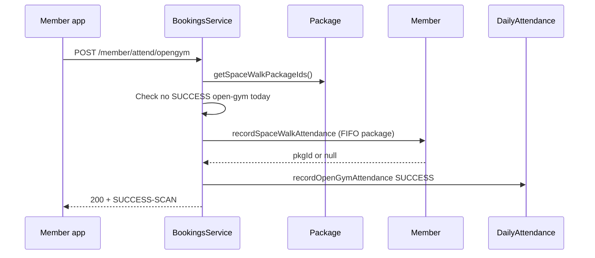

# Space walk-in deductions and payment refund reasons

This document describes the API changes added to support **space walk-in session deductions** and **payment refunds with audit reasons**. It explains what changed, why, and how to verify behavior.

---

## Background

The gym runs two related but separate concepts:

| Concept | What it means in the API |
|--------|---------------------------|
| **Payment refund** | A drop-in or other paid booking is cancelled; the `Payment` record is marked `isRefunded: true`. |
| **Session deduction / credit** | A member’s package `remainingClasses` goes down (deduct) or back up (add/refund) with an audit row in `adjustmentHistory`. |

Before these changes:

- **Space walk-in** (`POST /member/attend/opengym`) did not reliably debit sessions. The old `recordOpenGymAttendance` path could mark attendance without decrementing `remainingClasses` or writing a `SPACE_WALK` adjustment row.
- **Payment refunds** only flipped `isRefunded` with no human-readable **`refundReason`**, which made front-desk and finance reconciliation harder.
- **Automated adjustments** (bookings, cancellations, PT) often lacked a **`reason`** string, even though admin adjustments already required one.

The implementation aligns with the product rules documented in the sibling `project-dev` API docs: space walk-in should debit one session from an eligible package, and refunds should be explainable in admin payment listings.

---

## 1. Payment refunds — `refundReason`

### What changed

| Location | Change |
|----------|--------|
| `src/models/payment.ts` | New optional field: `refundReason` |
| `src/services/payments-service.ts` | `refundPayment(paymentId, session, refundReason?)` stores the reason when provided |
| `src/services/bookings-service.ts` | Drop-in cancellation passes a reason, e.g. `Drop-in cancellation: {className}` |
| `src/services/scheduler-service.ts` | Cancelling a scheduled class passes a reason, e.g. `Scheduled class cancelled: {className}` |

### Why

Refunding is not only a boolean flag. Staff need to know **why** a payment was refunded when reviewing `GET /admin/payments`—especially after bulk class cancellations or member drop-in cancels. Storing `refundReason` at refund time preserves that context without relying on external logs.

### What did *not* change

- No payment gateway (e.g. Geidea) reversal was added; this remains a **database-level** refund flag, consistent with existing behavior.
- Package unsubscribe (`DELETE /admin/member-packages`) still does not auto-refund package purchase payments.

---

## 2. Space walk-in — `SPACE_WALK` deductions

### What changed

| Location | Change |
|----------|--------|
| `src/models/package.ts` | New static `getSpaceWalkPackageIds()`; `OPEN_GYM` added to package `category` enum |
| `src/models/member.ts` | New adjustment source `SPACE_WALK`; new static `recordSpaceWalkAttendance` (replaces broken instance `recordOpenGymAttendance`) |
| `src/services/bookings-service.ts` | `recordOpenGymAttendance` rewritten: eligibility, duplicate-day guard, debit, daily attendance log |

### Flow (member `POST /member/attend/opengym`)

1. Load **eligible package definition IDs** (catalog), not only Ultimate + a single Open Gym row.
2. Reject if the member already has a **successful** open-gym attendance record for the current UTC day (`409 ATTENDANCE_ALREADY_RECORDED`).
3. In a transaction:
   - Debit **1** session from the **oldest active** member package whose `pkgId` is in the eligible set (FIFO by `pkgStartDate`).
   - Push `adjustmentHistory`: `source: "SPACE_WALK"`, `type: "DEDUCT"`, `amount: 1`, `reason: "Space walk-in"`.
   - Record success in `DailyAttendance.openGymAttendance`.
4. Emit `OPEN_GYM_CLASS_ATTENDED` on the socket dashboard.

### Eligible package definitions (“from all packages”)

“All packages” here means **all catalog package types that grant space access**, not debiting every subscription at once. One check-in debits **one** member package instance.

`Package.getSpaceWalkPackageIds()` returns IDs where:

| Rule | Examples |
|------|----------|
| `category` is `ULTIMATE_MINDSPACER` | 1 / 3 / 6 / 12 Month Ultimate Mindspacer |
| `category` is `SPACE_MEMBERSHIP` | Dedicated space membership products |
| `category` is `OPEN_GYM` | Open gym packages (category enum added for this) |
| `category` is `MIXED` **and** `name` matches `/space/i` | Spacer Mix (Studio + Space), Spacer Mix (Functional Training + Space) |

Studio-only or FT-only packages are **not** included unless they match the rules above.

### Why

- **Business rule:** Walking into “the space” should consume a session from memberships that include space access (Ultimate, space mix bundles, etc.).
- **Audit:** `SPACE_WALK` in `adjustmentHistory` separates space walk-ins from class bookings (`BOOKING`) and PT scans (`PT_ATTENDANCE`).
- **Bug fix:** The previous open-gym path did not consistently decrement sessions or log adjustments; the new static mirrors the proven PT attendance pattern (atomic `$inc`, completion status when sessions hit 0).

### Duplicate same day

The API enforces **one successful space walk-in per member per UTC calendar day** via `DailyAttendance`. A second attempt on the same day returns **409** and does **not** debit again.

---

## 3. Adjustment history — `reason` on automated rows

### What changed

`adjustmentHistory` entries now include a **`reason`** string for automated flows, not only admin `PATCH /admin/member-packages/adjust`:

| `source` | `type` | Example `reason` |
|----------|--------|------------------|
| `BOOKING` | `DEDUCT` | `Booked class: Mat Pilates` (or with credit count if `points > 1`) |
| `PT_ATTENDANCE` | `DEDUCT` | `PT attendance: {package name}` |
| `SPACE_WALK` | `DEDUCT` | `Space walk-in` |
| `MEMBER_CANCELLATION` | `ADD` | `Member cancellation: {class title}` |
| `FRONTDESK_CANCELLATION` | `ADD` | `Front-desk cancellation: {class title}` |
| `ADMIN` | `ADD` / `DEDUCT` | Operator-supplied (unchanged; still required in API) |

`removeBooking` now accepts an optional `className` so cancellation credits can reference the class title.

### Why

Admin adjustments already required `reason`; automated events did not, which made support tickets harder (“why did my sessions drop?”). Consistent `reason` text on every write makes `GET /admin/member` self-explanatory for front desk and engineering.

---

## 4. Files touched (summary)

| File | Role |
|------|------|
| `src/models/payment.ts` | `refundReason` schema field |
| `src/services/payments-service.ts` | Persist refund reason |
| `src/models/package.ts` | Space-walk eligibility query + `OPEN_GYM` enum |
| `src/models/member.ts` | `SPACE_WALK`, `recordSpaceWalkAttendance`, cancellation/booking reasons |
| `src/services/bookings-service.ts` | Space walk-in orchestration; drop-in refund reason |
| `src/services/scheduler-service.ts` | Class-cancel refund reason; pass class name into `removeBooking` |

---

## 5. How to verify

### Space walk-in

1. Ensure the member has an **active** subscription tied to an eligible package (e.g. Spacer Mix with “Space” in the name, or Ultimate).
2. `POST /member/attend/opengym` with member auth.
3. `GET /admin/member?uid={uid}`:
   - `remainingClasses` decreased by **1** on the debited package.
   - Latest `adjustmentHistory` entry: `source: "SPACE_WALK"`, `type: "DEDUCT"`, `reason: "Space walk-in"`.
4. Repeat the same request the same UTC day → **409** `ATTENDANCE_ALREADY_RECORDED`.

### Payment refund reason

1. After **drop-in cancel** (`POST /member/cancel-dropin/{scid}` within the 3-hour window) or **admin delete schedule** (`DELETE /admin/schedule/{scid}`), call `GET /admin/payments`.
2. Confirm affected payments have `isRefunded: true` and a non-empty `refundReason`.

---

## 6. Operational notes

- **`OPEN_GYM` category:** Valid on new/updated package documents. If you sell a standalone open-gym product, create it with `category: "OPEN_GYM"` so it appears in `getSpaceWalkPackageIds()`.
- **Existing MongoDB payments:** Documents created before deploy simply have no `refundReason` until refunded again (only new refunds set the field).
- **No migration script** was added; new fields are optional and backward compatible.

---

## 7. Related endpoints (unchanged URLs)

| Method | Path | Notes |
|--------|------|--------|
| `POST` | `/member/attend/opengym` | Space walk-in; now debits + `SPACE_WALK` |
| `POST` | `/member/cancel-dropin/:scid` | Sets `refundReason` on payment |
| `DELETE` | `/admin/schedule/:scid` | Refunds linked payments with `refundReason` |
| `PATCH` | `/admin/member-packages/adjust` | Still requires `reason` for manual ADD/DEDUCT |

For broader API reference, see `docs/API_DOCUMENTATION.md`.
